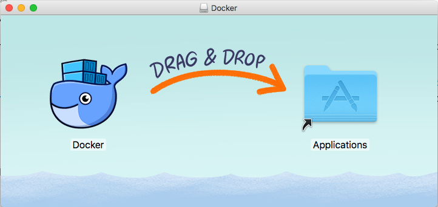
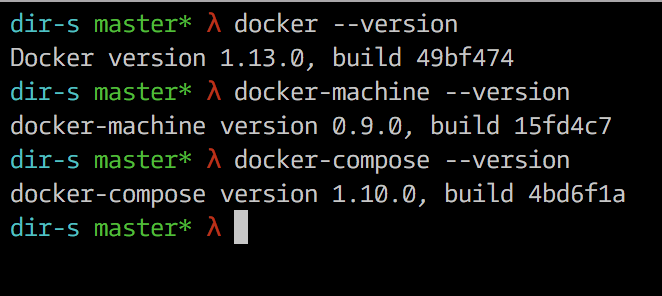
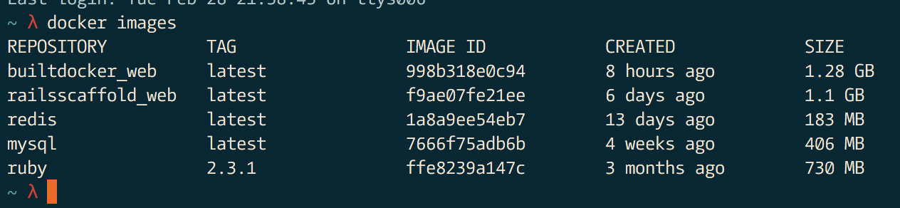
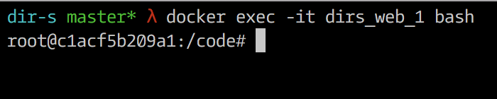

# Rails Scaffold

To get started with Docker, [download Docker for Mac](https://docs.docker.com/docker-for-mac/).



Docker for mac will give you three things out of the box:



* `docker-machine` is used to create virtual machines. You can pass in a flag to create them in virtualbox, but this is largely unused (at least I think) now that the hyperkit vm is used.
* `docker-compose` is the utility that is used to create and run containers with multiple running services (e.g. redis, db, node, celery).

###### Images and containers

* `images` are read only templates used to create containers. these are created with the build command. and are stored in a docker registry (docker hub). If an image was a class, then a container is an instance of a class.
	* `docker images`: show all images
* `containers` are created from images and contain all the binaries and dependencies necessary.
	* `docker ps`: show running containers
	* `docker ps -a`: show all containers



###### Container management/usage

Open up a bash shell in a running container:

```
docker exec -it container_name bash
```

For example



Start container(s) in detached mode:

```
docker compose up -d
```

Connect to a detached container:

```
docker attach container_name
```

Stop all containers:

```
docker stop $(docker ps -a -q)
```

Remove container by name:

```
docker rm container_name
```

Remove all containers:

```
docker rm $(docker ps -a -q)
```
Remove an image by id:

```
docker rmi image_id
```

Remove all images:

```
docker rmi $(docker images -q)

```